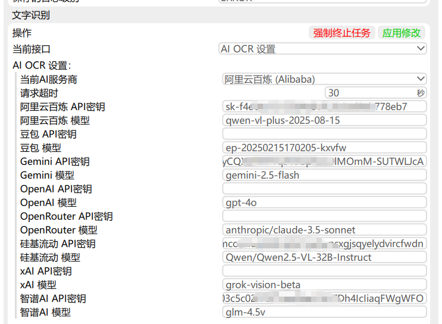
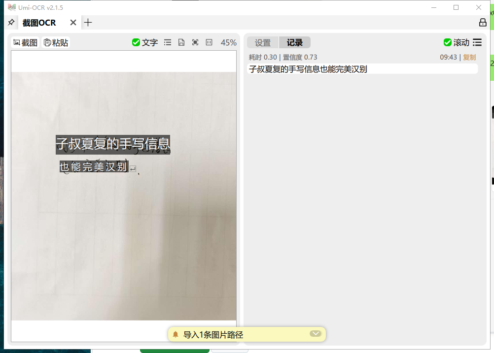

# Umi-OCR AI OCR 插件

## 🚀 项目简介

本插件为 **Umi-OCR** 提供多个主流AI模型的OCR 功能，支持主流 AI 服务提供商的视觉识别 API。作为离线 OCR 的强力补充，为用户提供更高精度、更广泛语言支持的云端文字识别服务。


## 🌟 支持的 AI 服务商

| 服务商 | 建议模型 | 特点 |
|--------|----------|------|
| **OpenAI** | GPT-5, GPT-4o-mini | 高精度，多语言支持 |
| **Google Gemini** | gemini-2.5-flash | 速度快，成本低 |
| **xAI Grok** | grok-4 | 创新模型，独特优势 |
| **OpenRouter** | 多种模型可选 | 统一接口，模型丰富 |

## 📋 关于 Umi-OCR

**Umi-OCR** 是一款免费、开源、可批量的离线OCR软件，基于 PaddleOCR 开发。它具有以下特点：

[](https://github.com/hiroi-sora/Umi-OCR)
[](LICENSE)
[](https://www.python.org/)
[]()

- 🆓 **完全免费**：无需付费，无广告，开源软件
- 📱 **界面友好**：现代化的图形界面，操作简单直观
- 🔄 **批量处理**：支持批量图片OCR，提高工作效率
- 🌐 **多语言支持**：支持中文、英文、日文、韩文等多种语言
- 🔌 **插件系统**：支持扩展插件，功能可定制
- 💻 **跨平台**：支持Windows、Linux等操作系统

**项目地址**：[https://github.com/hiroi-sora/Umi-OCR](https://github.com/hiroi-sora/Umi-OCR)

## 🎯 插件特色

### 为什么选择多厂商 AI OCR 插件？

- **🎯 精度提升**：利用最先进的多模态AI模型
- **🌍 语言覆盖**：支持更多语言和复杂文档格式
- **🔄 完美集成**：无缝融入Umi-OCR工作流程
- **⚡ 灵活选择**：可根据需要在离线和云端OCR间切换
- **🏢 多厂商支持**：避免单一依赖，提供更多选择

## 📊 对比识别效果

### 设置界面


### 识别图片："对于及其复杂的手写信息，也能完美识别"


### PaddleOCR识别效果，结果很差劲


### WechatOCR识别效果，结果很差劲


### AI OCR识别效果，非常完美


## ✨ 功能特点

| 功能 | 描述 |
|------|------|
| 🚀 **高精度识别** | 基于最新的AI视觉模型，支持多种语言文字识别 |
| 🌍 **多语言支持** | 支持中文、英文、日文、韩文、法文、德文、西班牙文、俄文、阿拉伯文等 |
| ⚡ **多厂商选择** | 支持OpenAI、Gemini、xAI、OpenRouter等多个服务商 |
| 📍 **坐标提取** | 可选择输出文字的位置坐标信息 |
| 🔧 **灵活配置** | 支持图像质量、尺寸、超时等多项参数调整 |
| 🌐 **代理支持** | 支持HTTP/SOCKS5代理，适应不同网络环境 |
| 🔄 **智能重试** | 自动重试机制，提高识别成功率 |
| 🚀 **并发处理** | 支持批量图片并发识别，提高处理效率 |

## 📦 安装要求

1. **Umi-OCR软件**：需要安装 [Umi-OCR](https://github.com/hiroi-sora/Umi-OCR) v2.0+
2. **AI服务API密钥**：需要获取对应服务商的API密钥
3. **网络连接**：需要能够访问对应的AI服务
4. **Python环境**：Umi-OCR内置Python环境即可

## 🛠️ 安装步骤

### 方法一：直接下载

1. 下载本项目的所有文件
2. 将整个 `AIOCR` 文件夹复制到 Umi-OCR 的插件目录：
   ```
   UmiOCR-data/plugins/AIOCR/
   ```
3. 重启 Umi-OCR 软件
4. 在OCR引擎选择中找到 "AI OCR（云端）"

### 方法二：Git克隆

```bash
cd UmiOCR-data/plugins/
git clone https://github.com/EatWorld/UmiOCR-AI-OCR-Plugin.git AIOCR
```

## ⚙️ 配置说明

### 全局配置

| 配置项 | 说明 | 推荐值 |
|--------|------|--------|
| **AI服务商** | 选择要使用的AI服务提供商 | 根据需求选择 |
| **API密钥** | 对应服务商的API密钥 | 必填 |
| **API基础URL** | 自定义API基础URL | 可选，留空使用默认 |
| **模型** | 要使用的模型名称 | 根据服务商选择 |
| **请求超时** | API请求的超时时间 | 30秒 |
| **最大重试次数** | 请求失败时的重试次数 | 3次 |
| **代理URL** | HTTP/SOCKS5代理设置 | 按需配置 |
| **最大并发数** | 批量处理时的并发数 | 3-5个 |

### 局部配置

| 配置项 | 说明 | 选项 |
|--------|------|------|
| **识别语言** | 指定文字语言可提高识别精度 | 自动检测/中文/英文等 |
| **输出格式** | 识别结果的输出格式 | 仅文字/文字+坐标 |
| **图像质量** | 影响识别精度和传输速度 | 自动/高/中/低 |
| **最大图像尺寸** | 控制上传图像的大小 | 1024/2048/4096像素 |

## 🔑 API密钥获取

### OpenAI
1. 访问 [OpenAI Platform](https://platform.openai.com/api-keys)
2. 登录账号并创建API密钥
3. 复制生成的密钥

### Google Gemini
1. 访问 [Google AI Studio](https://aistudio.google.com/app/apikey)
2. 登录Google账号
3. 创建新的API密钥

### xAI Grok
1. 访问 [xAI Console](https://console.x.ai/)
2. 注册并获取API密钥

### OpenRouter
1. 访问 [OpenRouter](https://openrouter.ai/keys)
2. 注册账号并创建API密钥

## 📖 使用方法

### 1. 配置插件

1. 在Umi-OCR中选择 "AI OCR（云端）"
2. 在全局设置中选择AI服务商
3. 输入对应的API密钥
4. 选择合适的模型
5. 根据需要调整其他参数

### 2. 开始识别

- 使用截图OCR、批量OCR等功能
- 插件会自动调用对应的AI API进行识别
- 支持与本地OCR引擎混合使用

## ⚠️ 注意事项

1. **API成本**：AI API按使用量计费，请注意控制使用频率
2. **网络要求**：需要稳定的网络连接访问AI服务
3. **图像大小**：建议设置合适的最大图像尺寸以控制成本
4. **隐私安全**：图像会上传到AI服务器进行处理
5. **速度限制**：云端API可能有速度限制，不适合大量并发请求
6. **模型选择**：不同模型的精度和成本不同，请根据需求选择

## 🔧 故障排除

### 常见问题

| 问题 | 可能原因 | 解决方案 |
|------|----------|----------|
| API密钥无效 | 密钥错误或过期 | 检查密钥是否正确，确认权限和配额 |
| 网络连接失败 | 网络问题 | 检查网络连接，尝试配置代理 |
| 识别结果为空 | 图像质量问题 | 检查图像清晰度，调整质量设置 |
| 请求超时 | 网络延迟 | 增加超时时间，减小图像尺寸 |
| 模型不存在 | 模型名称错误 | 检查模型名称是否正确 |
| 服务商不可用 | 服务商问题 | 尝试切换到其他服务商 |

### 错误代码说明

- `code: 100`：识别成功
- `code: 200`：识别失败，错误信息在data字段中

### 获取帮助

如遇到问题，请检查：
1. Umi-OCR版本是否兼容
2. API密钥是否有效
3. 网络连接是否正常
4. 插件文件是否完整
5. 模型名称是否正确
6. 服务商服务是否正常

## 🔗 开发资源

- **Umi-OCR项目**：[https://github.com/hiroi-sora/Umi-OCR](https://github.com/hiroi-sora/Umi-OCR)
- **插件开发文档**：[https://github.com/hiroi-sora/Umi-OCR_plugins](https://github.com/hiroi-sora/Umi-OCR_plugins)
- **OpenAI API文档**：[https://platform.openai.com/docs](https://platform.openai.com/docs)
- **Google Gemini API文档**：[https://ai.google.dev/gemini-api/docs](https://ai.google.dev/gemini-api/docs)
- **xAI API文档**：[https://docs.x.ai/](https://docs.x.ai/)
- **OpenRouter API文档**：[https://openrouter.ai/docs](https://openrouter.ai/docs)

## 📝 版本历史

- **v2.0.0**：重构为多厂商AI OCR插件，支持OpenAI、Gemini、xAI、OpenRouter
- **v1.2.0**：支持Gemini 2.5 Flash和Pro预览版模型，优化识别精度
- **v1.1.0**：增加多语言支持，优化错误处理
- **v1.0.0**：初始版本，支持Gemini OCR功能

## 📄 许可证

本插件遵循 MIT 许可证。详见 [LICENSE](LICENSE) 文件。

## 🤝 贡献

欢迎提交Issue和Pull Request来改进这个插件！

### 贡献指南

1. Fork 本项目
2. 创建特性分支 (`git checkout -b feature/AmazingFeature`)
3. 提交更改 (`git commit -m 'Add some AmazingFeature'`)
4. 推送到分支 (`git push origin feature/AmazingFeature`)
5. 开启 Pull Request

## 💖 支持

如果这个插件对您有帮助，请考虑：

- 给项目点个星⭐
- 分享给更多需要的人
- 提供反馈和建议
- 参与项目贡献

---

**感谢使用 Umi-OCR 多厂商 AI OCR 插件！**
